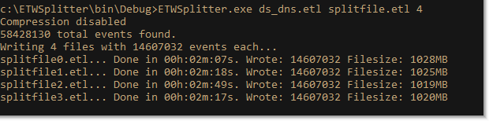

ETWSplitter

I had a 4GB ETW file (event tracing for Windows) that I needed to analyze with Message Analyzer.

But Message Analyzer couldn't handle it because it was too large.

So I wanted to break the *.etl file up into smaller chunks so that my analysis tools could handle it in smaller pieces.

But this is a binary ETW trace. It is not as trivial to split these files as just a simple text file.

So I found the Microsoft.Diagnostics.Tracing.TraceEvent library which you can find on Nuget.

https://www.nuget.org/packages/Microsoft.Diagnostics.Tracing.TraceEvent/

I wrote this little program in 10 minutes to break up these *.etl files into smaller chunks.

- Usage: ETWSplitter.exe <InputFile.etl> <OutputFile.etl> <#_of_Files> [compress]

No compression:

There is optional compression you can use too.

Really, this program is trivial, but was very useful to me and my colleagues at the time. All of the real magic is in the TraceEvent library, which isn't mine.

You can find a compiled ETWSplitter.exe in the Releases section.